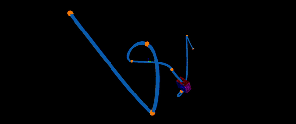

# Hi there I'm [Yunfan][portfolio]!👋

- I'm currently learning game programming in SMU Guildhall.
- I'm building a custom C++ game engine with DirectX12 and Procedural Content Generation.

## Connect with me

 

[][portfolio]
[][LinkedIn]

 

[portfolio]: https://www.yunfanhe.com 
[linkedin]: https://www.linkedin.com/in/yunfan-he/

<!--
**cloud-sail/cloud-sail** is a ✨ _special_ ✨ repository because its `README.md` (this file) appears on your GitHub profile.

Here are some ideas to get you started:

- 🔭 I’m currently working on ...
- 🌱 I’m currently learning ...
- 👯 I’m looking to collaborate on ...
- 🤔 I’m looking for help with ...
- 💬 Ask me about ...
- 📫 How to reach me: ...
- 😄 Pronouns: ...
- ⚡ Fun fact: ...
-->

